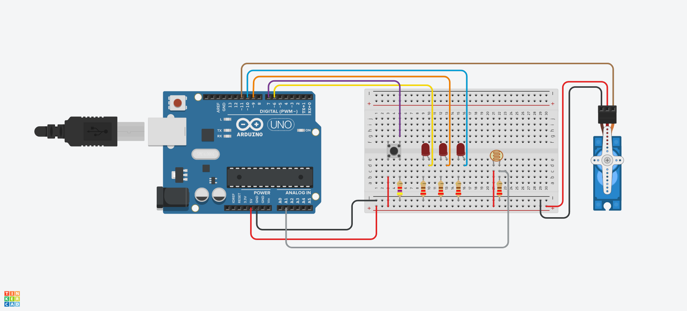

# IlluminationSensor
IlluminationSensor_Apply

+ **IlluminationSensor_LED**
  + 조도센서를 아날로그 핀 A1에 연결, LED 핀은 9번핀에 연결한다. 
  + 조도센서의 값이 200보다 크면 LED가 켜지고 그 외에는 LED가 꺼진다.
  
+ **IlluminationSensor_LED_Switch**
  + 조도센서를 아날로그 핀 A1에 연결, LED 핀은 9번핀에 연결한다. 
  + 조도센서의 최소값을 0으로 최대값을 600으로 설정하고 그 값을 'map'함수를 통해 0~3까지의 범위로 나눈다.
  + 0~1은 어두운 경우라 생각하여 그 범위의 값이 감지되면 LED를 켜고, 그 외의 상황에서는 LED를 끈다.
  
+ **IlluminationSensor_Servo**
  + 조도센서를 아날로그 핀 A1에 연결, Servo를 11번핀에 연결한다. 
  + 조도센서의 최소값을 0으로 최대값을 600으로 설정하고 그 값을 'map'함수를 통해 0~3까지의 범위로 나눈다.
  + 완전히 어두워진 경우 즉 0의 값이 감지됐을 때 Servo를 90도 회전시키고, 그 외의 상황에서는 0도로 유지한다.
